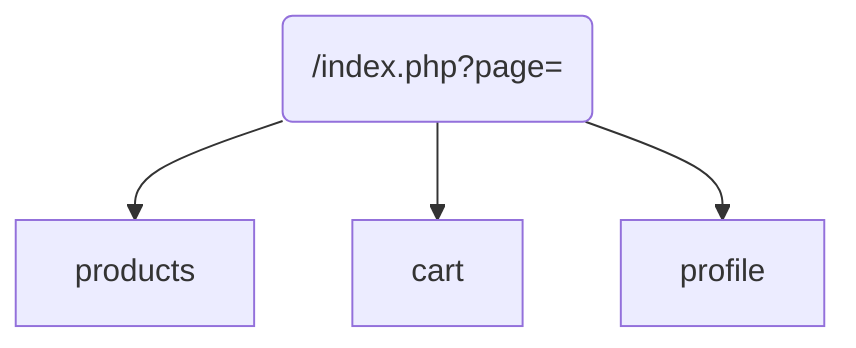

# Crouskie - Site internet

Ce projet est réalisé par les étudiants de l'IUT Info Lyon 1.

[TOC]

## Fonctionnement Back-End

Le fonctionnement du site est basé sur le modèle **MVC** permettant une facilité d'évolution et de maintenant accrue, cependant cela requiert une certaine organisation.

> Modèle-vue-contrôleur ou **MVC** est un **motif d'architecture logicielle destiné aux interfaces graphiques lancé en 1978 et très populaire pour les applications web**. Le motif est composé de trois types de modules ayant trois responsabilités différentes : les modèles, les vues et les contrôleurs.

### Représentation des pages

